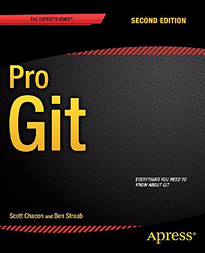

We've all been in this situation before: it seems ridiculous to have multiple
nearly-identical versions of the same document. Some word processors let us deal
with this a little better, such as Microsoft Word's "Track Changes" or Google Docs'
version history. Even if you aren't collaborating with other people, automated
version control is much better than this situation:

"Piled Higher and Deeper" by Jorge Cham, http://www.phdcomics.com

A colleague suggests using [version control](reference.html#version-control) to
manage their work. Version control is better than mailing files back and forth:

*   Nothing that is committed to version control is ever lost. Since all old
    versions of files are saved, it's always possible to go back in time to see
    exactly who wrote what on a particular day, or what version of a program
    was used to generate a particular set of results.

*   As we have this record of who made what changes when, we know who to ask
    if we have questions later on, and, if needed it, revert to a previous
    version, much like the "undo" feature in an editor.

*   When several people collaborate in the same project, it's possible to
    accidentally overlook or overwrite someone's changes: the version control
    system automatically notifies users whenever there's a conflict between one
    person's work and another's.

Teams are not the only ones to benefit from version control: lone
researchers can benefit immensely.  Keeping a record of what was
changed, when, and why is extremely useful for all researchers if they
ever need to come back to the project later on (e.g., a year later,
when memory has faded).

Version control is the lab notebook of the digital world: it's what
professionals use to keep track of what they've done and to
collaborate with other people.  Every large software development
project relies on it, and most programmers use it for their small jobs
as well.  And it isn't just for software: books,
papers, small data sets, and anything that changes over time or needs
to be shared can and should be stored in a version control system.

> ## Prerequisites {.prereq}
>
> In this lesson we use Git from the Unix Shell.
> Some previous experience with the shell is expected,
> *but isn't mandatory*.

> ## Getting ready {.getready}
>
> Nothing to do: you're ready to go!

## Topics

1.  [Version Control Introduction](01-basics.html)
2.  [Setting Up Git](02-setup.html)
3.  [Creating a Repository](03-create.html)
4.  [Tracking Changes](04-changes.html)
5.  [Exploring History](05-history.html)
6.  [Ignoring Things](06-ignore.html)
7.  [Remotes in GitHub](07-github.html)
8.  [Collaborating](08-collab.html)
9.  [Conflicts](09-conflict.html)

## Additional Material

1.   [Git & R-Studio](A01-gitrstudio.html)
2.   [Other Git Commands](A02-advanced.html)
3.   [Open Science](A03-open.html)
4.   [Licensing](A04-licensing.html)
5.   [Hosting](A05-hosting.html)
6.   [Instructor's Guide](A06-instructors.html)
7.   [Reference & Glossary](A07-reference.html)

## Further Reading

The entire Pro Git book, written by Scott Chacon and Ben Straub and published by Apress,
is available from [https://git-scm.com/book/en/v2](https://git-scm.com/book/en/v2).
All content is licensed under the
[Creative Commons Attribution Non Commercial Share Alike 3.0 license](http://creativecommons.org/licenses/by-nc-sa/3.0/).
Print versions of the book are available on [Amazon.com](Amazon.com).

